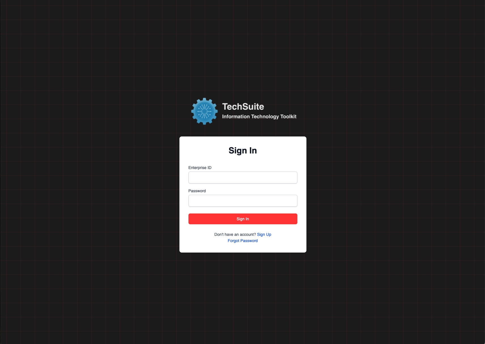
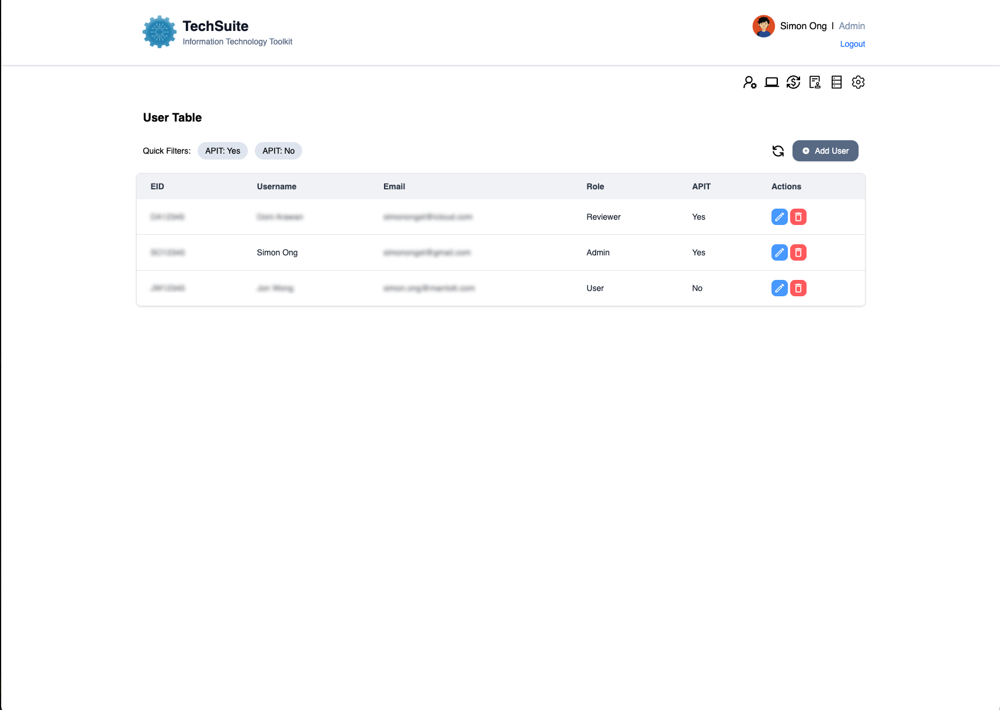
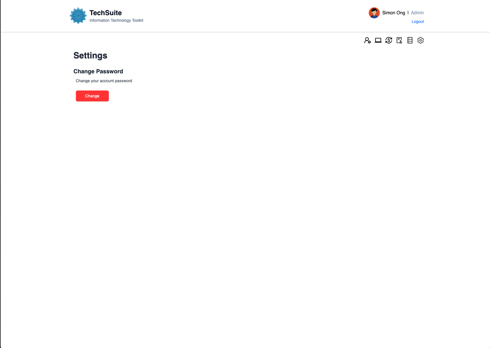
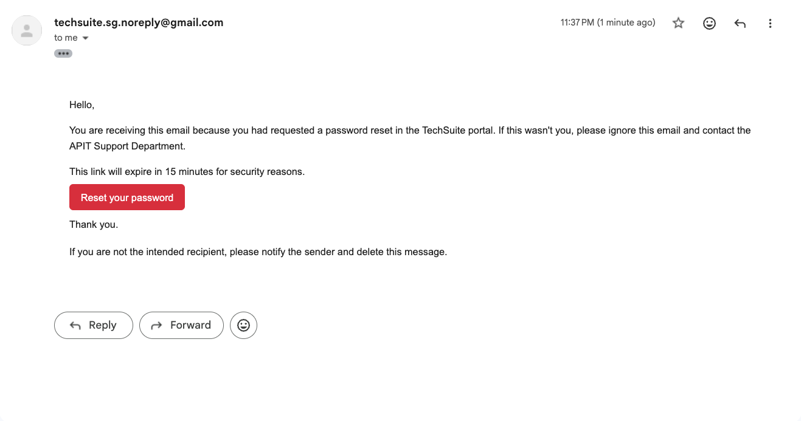
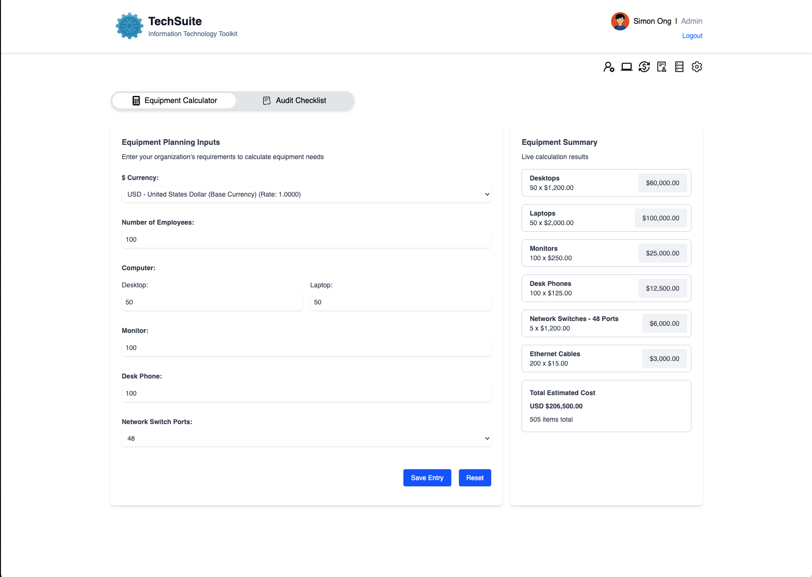
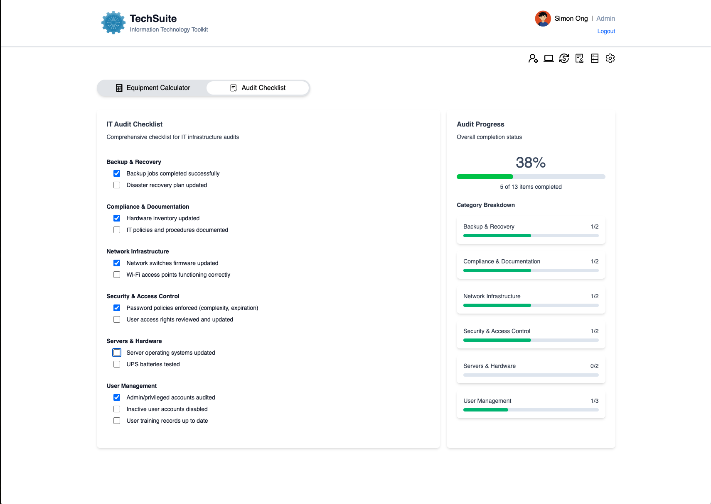
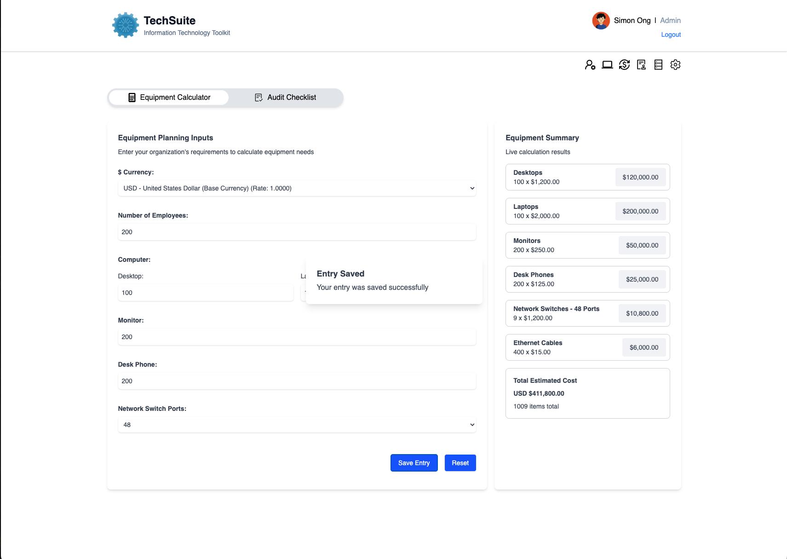
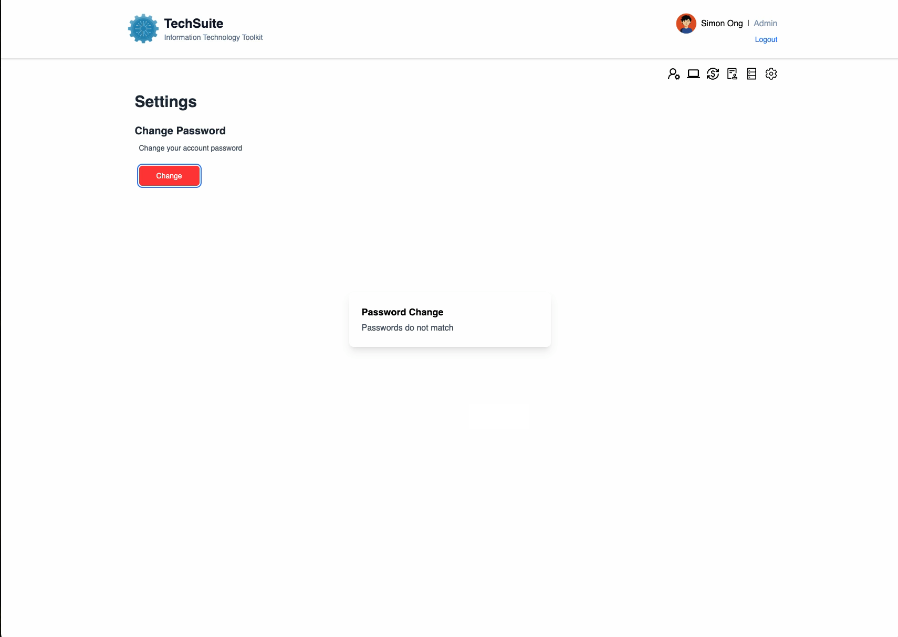

<!DOCTYPE html>
<html lang="en">
<head>
  <meta charset="UTF-8" />
</head>
<body>
  

  <h2>About the App</h2>
  

    TechSuite is a comprehensive IT toolkit built to simplify equipment budgeting and audit workflows.
    The IT Equipment Calculator enables teams to estimate costs for office setup or planning purposes, 
    while the IT Audit Checklist provides structured progress tracking and allows supervisors to monitor individual task completion.
  

  <h2>Getting Started</h2>
  <ul>
    <li>Deployed App: <a href="https://techsuite-fe-production.up.railway.app" target="_blank">https://techsuite-fe-production.up.railway.app</a></li>
    <li>Backend Repository: <a href="https://github.com/Simonongst/TechSuite-BE" target="_blank">https://github.com/Simonongst/TechSuite-BE</a></li>
  </ul>

  <h2>Features</h2>
  <ul>
    <h3>Authentication</h3>
    <li>Secure sign-up/sign-in with hashed passwords and JWT-based sessions</li>
     
    <h3>User Management</h3>
    <li>Add, edit and manage users with role-based access (User, Editor, Reviewer, Admin).</li>
     
    <h3>Password Management</h3>
    <li>Change-password and forgot-password workflows</li>
     
     
    <h3>Equipment Calculator</h3>
    <li>Calculate and track IT equipment costs with currency support.</li>
     
    <h3>Audit Checklist</h3>
    <li>Interactive checklist with toggle logic, category grouping and progress tracking.</li>
     
    <h3>Notifications</h3>
    <li>Modular toast messages for success/error feedback</li>
     
     
  </ul>

  <h2>Attributions</h2>
  <ul>
    <li><a href="https://nodemailer.com/" target="_blank">Nodemailer</a></li>
    <li><a href="https://www.radix-ui.com/" target="_blank">Radix UI</a></li>
    <li><a href="https://react-icons.github.io/react-icons/" target="_blank">React Icons</a></li>
  </ul>

  <h2>Technologies Used</h2>
  <ul>
    <li>React</li>
    <li>Express + Node.js</li>
    <li>Nodemailer</li>
    <li>JavaScript</li>
    <li>HTML</li>
    <li>TailwindCSS</li>
    <li>JWT</li>
    <li>Axios</li>
    <li>MongoDB</li>
    <li>Mongoose</li>
  </ul>

  <h2>Next Steps</h2>
  <ul>
    <li>Develop an Audit Dashboard Overview for high-level insights</li>
    <li>Implement an Audit Template Table for reusable checklist structures</li>
    <li>Add pagination to table to improve navigation and scalability</li>
    <li>Create a Knowledge Repository tab that hosts PDF resources, allowing users to read online or download for offline access.</li>
    <li>Integrate Currency API fetching for real-time exchange rate updates</li>
  </ul>

</body>
</html>
